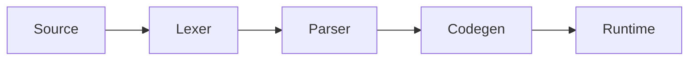

# hsuScript

[](https://github.com/Mahko-AFK/hsuScript/actions/workflows/build.yml)
[](https://github.com/Mahko-AFK/hsuScript/actions/workflows/tests.yml)

hsuScript is a small educational compiler written in C that demonstrates the complete pipeline from lexical analysis to runtime execution, aiming to provide an approachable example for developers interested in learning how compilers work and how languages are designed.

## About hsuScript

hsuScript breaks source files into tokens, builds an abstract syntax tree, generates code, and executes the result through a minimal runtime.



## Features

- Written in portable C
- Lexer and parser producing an AST
- Simple code generation and runtime support
- Scripts with variables, control flow, strings, and arithmetic
- Comprehensive test suite

## Project Structure

```text
.
├── lexer.c        # tokenizes source code
├── parser.c       # builds the AST
├── codegen.c      # emits code
├── runtime/       # runtime support library
├── tests/         # parser and execution tests
└── tools/         # build and test scripts
```

## Quick Start

1. Build the compiler:
   ```bash
   ./tools/build.sh
   ```
2. Compile and run a script:
   ```bash
   ./build/hsc path/to/file.hsc
   ```

## Testing

Run parser fixtures:

```bash
./tools/runtests.sh
```

Run the full test suite, including execution checks:

```bash
./tools/run_all_tests.sh
```

## Contributing

- Fork the repository and create a feature branch
- Make your changes and run the test suite
- Submit a pull request describing your work

## License

This project is licensed under the MIT License. See [LICENSE](LICENSE) for details.

